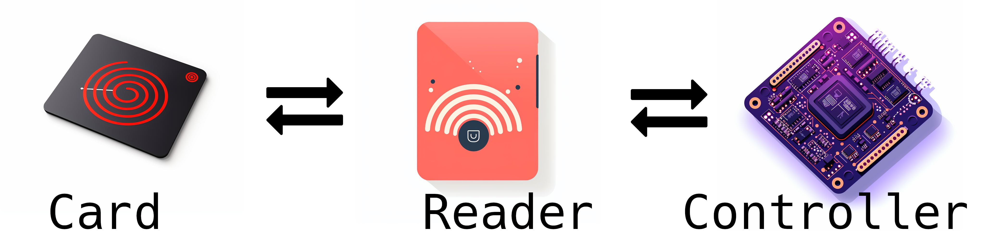
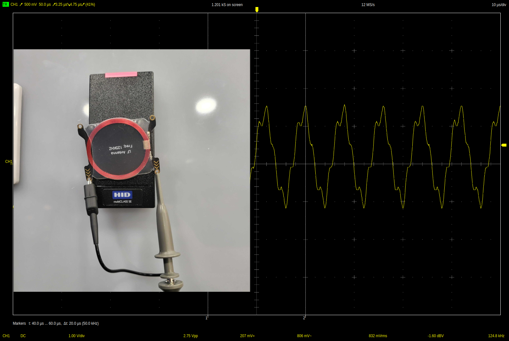
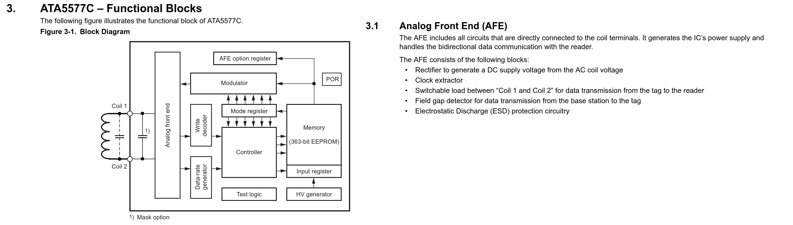
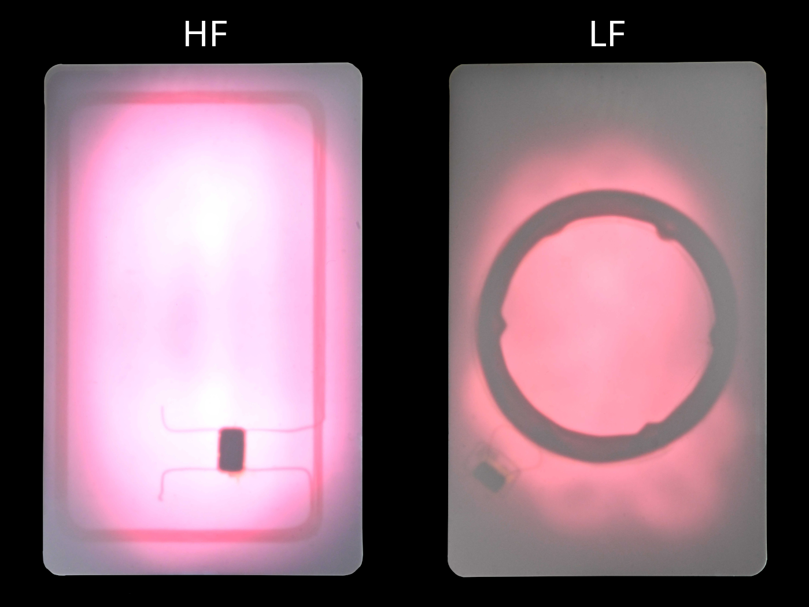
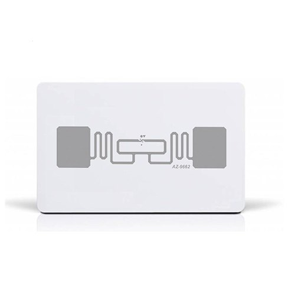
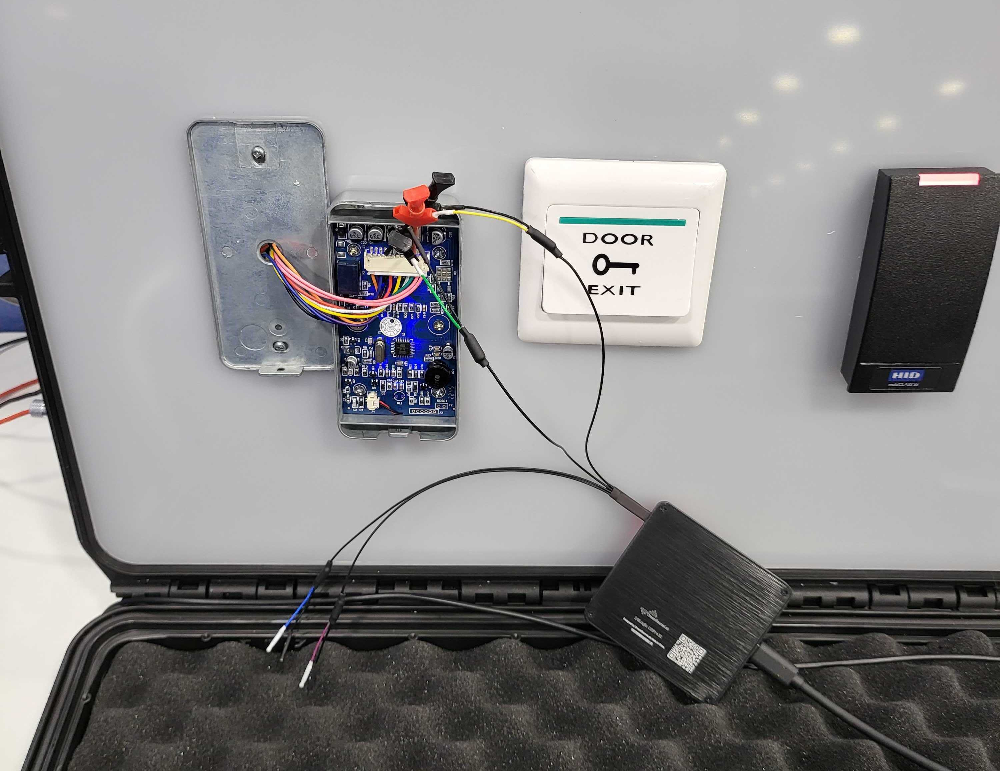
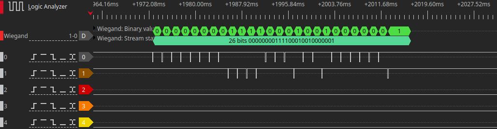
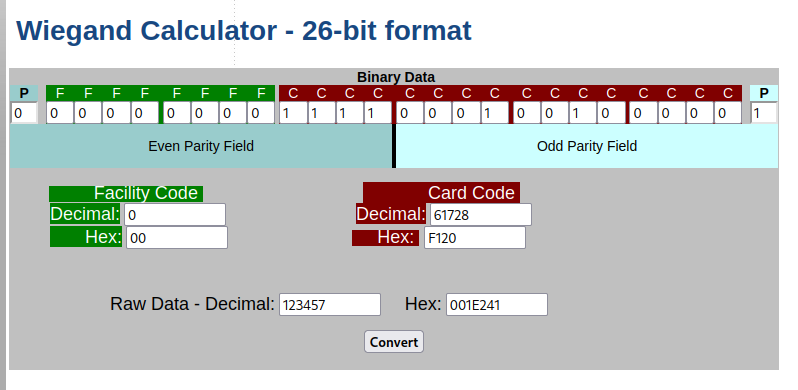
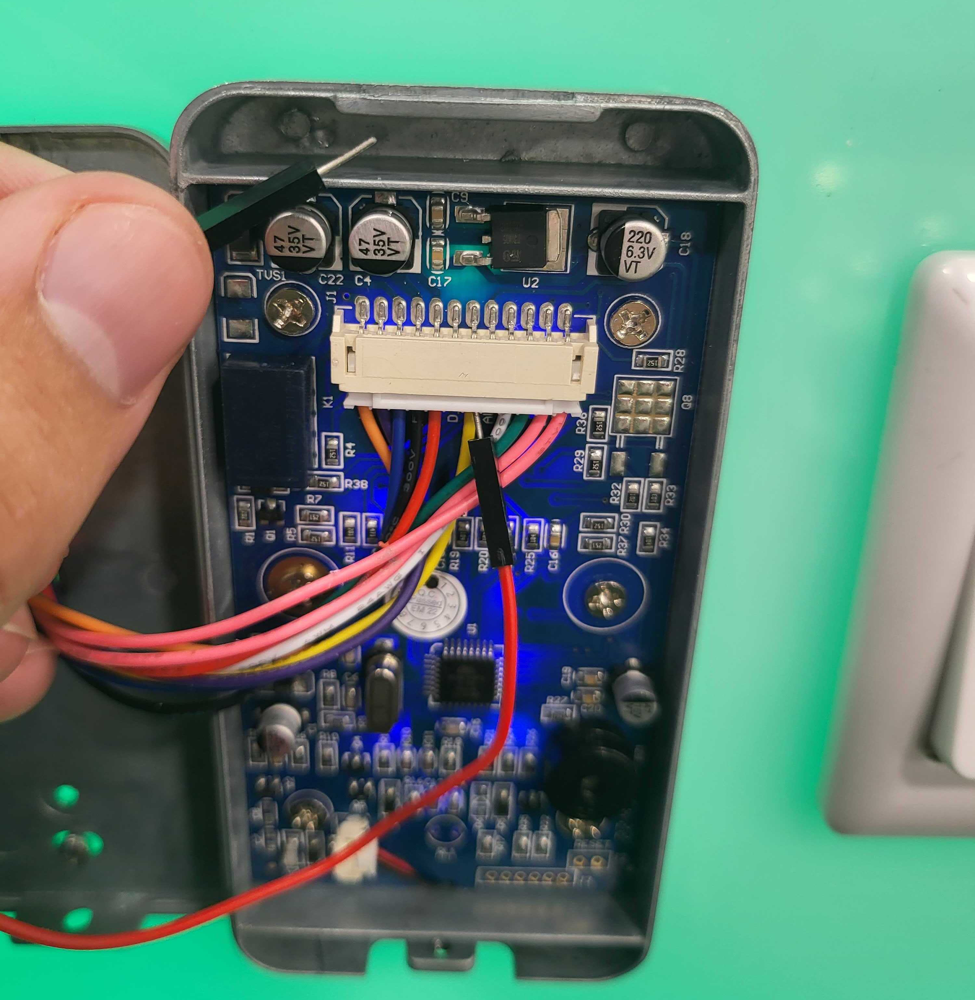
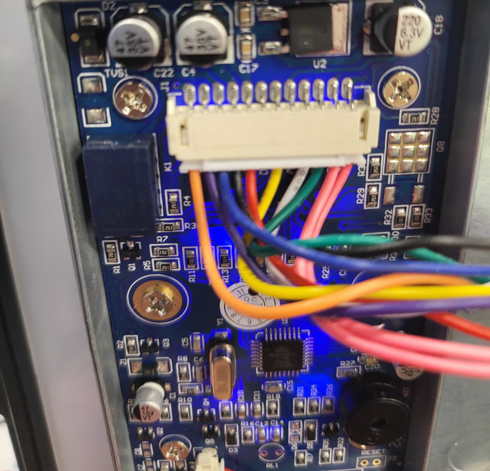

# About me

 * nemanjan00
 
 * I like to take things apart
 
 * Sometimes put them back together
 
 * Reverse Engineering, RND and DevOps @ Constallation

# Access control system



# About presentation

Scope: 

 * RFID credentials (cards)
 
 * RFID readers

 * Wiegand (Reader <-> controller protocol)
 
 * Highlevel controller overview
 
 * Integrator and manufacturers mistakes and problems

Out of scope: 

 * Magnetic tape
 
 * Biometrics
 
 * Plate recognition
 
 * OSDP (Reader <-> controller protocol)
 
 * Business logic

# Card (ass grab tech)

Unique ID

 * Different length

 * Magic cards (Backdoored cards - changable UID)

Power supply:

 * Active (Battery powered)

 * Passive (Reader powered)

Frequency:

 * LF (125kHz, 134khz)

 * HF (13.56Mhz)
 
 * UHF (300Mhz - 3Ghz) - Mostly for inventory systems, parking and tolls

# Powering card - Electromagnetic induction

Current gets induced in one of these cases:

 * Conductor moves in constant field

 * Conductor is in alternating field

How is this used?

 * Sinusoid signal at proper frequency (125kHz for example)

 * Resonant antenna

   * Antenna length depends on wavelength (length light travels during one oscilation)

   * Lower frequency, bigger antenna

# Powering card showcase



# Command modulation - Reader to card

 * Capacitor can be used to store power

 * Sine cycles can be skipped, to modulate data (commands)



# Data modulation - Load modulation - Card to reader

 * Load on card = Load on power source

 * Increase in load = Decrease in voltage

 * It can be measured across both antennas

 * It can be measured in field (sniffing)

 * Switching load on and off can be used for modulation

```bash
# showcase load modulation phenomenon
hf tune --mix
lf tune --mix
```

```bash
# showcase card demodulation
data plot
lf search
lf em 410x demod
```

# Figuring out the frequency

 * Flashlight (antennas do not look the same)

 * Field detector



# LF cards

 * One-way communication or simple two-way communication

 * Slow communication

 * Mostly no security features (auth or encryption)

 * Simple implementations

   * Modulation

   * Baudrate

   * Inverted

# LF card standards

 * HID Proxcard

 * EM4100

 * HiTag

 * Indala

...

 * T5577 can emulate other cards

 * ISO 11784 / 11785 Standard - Animal chips

# Vulnerabilities and characteristics

 * Trivial to read

 * Trivial to clone or emulate

 * Requires big antennas for great performance, due to low frequency

# Tools

|Tool|Read|Write|Emulate|Note|
|-|-|-|-|-|
|Proxmark3|Yes|Yes|Yes|Steep learning curve|
|Blue cloner|Yes|Yes|No|No display for ID|
|White cloner|Yes|Yes|No|Sets password|
|Tinylabs Keysy|Yes|Yes|Yes|Closed source|
|Chameleon Ultra|Yes|Yes|Yes|Only EM4100 right now|
|Flipper Zero|Yes|Yes|Yes|Great support|
|ICopyX|Yes|Yes|No||

# HF cards

 * Two-way communication

 * Fast communication

 * Very flexible in terms of features

 * Quite a few standards, substandards and classes of standards implementations

 * Some standards support anti-collision

# Vulnerabilities and characteristics

 * More advanced modulation techniques

 * Proprietary communication protocols

 * Sometimes encrypted

 * Sometimes programmable (Java SmartCard)

 * Readers do not always use proprietary features and sometimes rely on low level stuff like UID)

 * Can be cloned, but relies on understandind the tech implemented in a card

 * Higher frequency means smaller performant antennas = long range cloning (few 10s of cm)

# HF card standards

RF communication: ISO 14443 A, ISO 14443 B, ISO 15693, ISO 18092

Application protocols: ISO 7816 (APDU) over ISO 14443 A/ISO 14443 B, Mifare Classic, Mifare Ultralight, ISO 15693 (NFC-V)

Implementations either extend existing command set or utilize ISO 7816 (APDU) over underlaying protocols.

# Tools

|Tool|Read|Write|Emulate|Note|
|-|-|-|-|-|
|Proxmark3|Yes|Yes|Yes|Timing issues for emulation|
|Chameleon Mini (Tiny)|Yes|No|Yes|Timing issues for emulation|
|Chameleon Ultra|Yes|No|Yes|Still too new|
|Flipper Zero|Yes|Yes|Yes|Timing issues for emulation|
|Long Range Readers|Yes|Yes|Yes|10-20cm|
|PN532|Yes|Yes|Yes|LibNFC|
|DL533N|Yes|Yes|Yes|LibNFC|

Type of card dependant

# UHF cards



ISO 18000

Unique ID is called TID

Has readable memory

# Controller

Input signal:

 * Wiegand

 * OSDP (out of scope)

Output signal:

 * Control the relay

 * Audiovisual feedback

# Wiegand



# Wiegand to ID





# Attacks

 * Cloning credentials

 * Hardcoded/default credentials

 * Fuzzing attacks

 * Downgrade attacks

 * Tearoff attacks

 * Crypto or PRNG implementation attacks (for example nested, hardnested and darkside attacks on Crypto1)

 * Wiegand sniffing and replay

 * Controller and reader combo attacks

# Hardcoded/default credentials

 * Some controllers come with default credentials hardcoded

 * There are backdoor credentials

 * Some of them have been leaked (No security by obscurity)

# Fuzzing attacks

 * There have been cases where readers did unlock for some extreme values

 * 0x0000000000

 * 0xFFFFFFFFFF

# Controller and reader combo attacks

 * Default password can be used to register new credentials

 * Push to unlock button is on the outside

   * Signal wire is connected to VCC using pull up resistor

   * Button connects signal wire to ground

   * When voltage falls below certain value, relay is connected, to unlock

   * Color scheme for wiring is well known

 * Relay is on the outside

   * Relay = Electromagnet connected to metal plate and metal plate on spring

   * External magnetic field can activate relay

 * Unused wiegand wires usually present

# Push to exit



# External relay



# Extra - Privacy concerns with UHF RFID cards

Product identification by GS1 standards

 * UPC

   * Company prefix
 
   * Item reference number

 * EPC

   * Company prefix
 
   * Item reference number
 
   * Product serial number


# H&M

```bash
SVC="https://app2.hm.com/hmwebservices/service"
EPC="07314308132190"

ID=$(curl \ 
  "$SVC/app/getArticleByScannedBarcode/hm-serbia?gtinCodes=$EPC" \
  -H "user-agent: targetapp_android_21" | jq -r ".[0]")

REAL_ID=$(echo $ID | cut -c1-10)

curl \
  "$SVC/article/get-article-by-code/hm-serbia/Online/$REAL_ID/sr.json" \
  -H "user-agent: targetapp_android_21" | jq ".product.name"
```

# About the community

 * Iceman Discord
 
 * RRG Github
